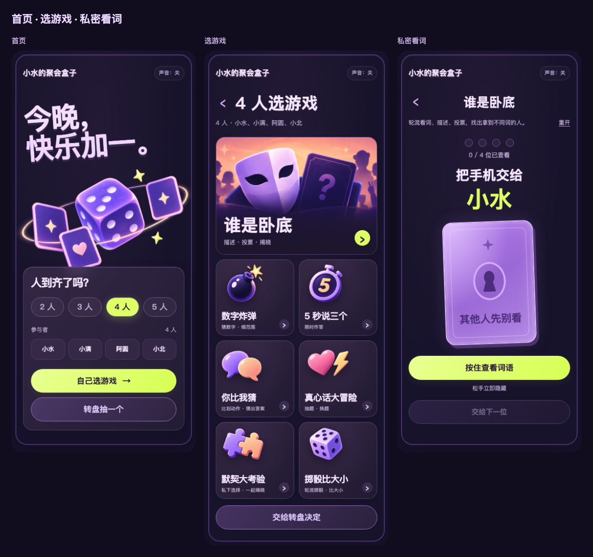
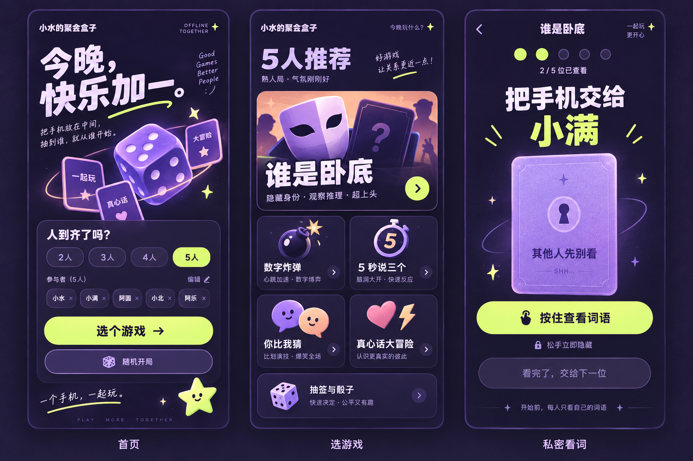
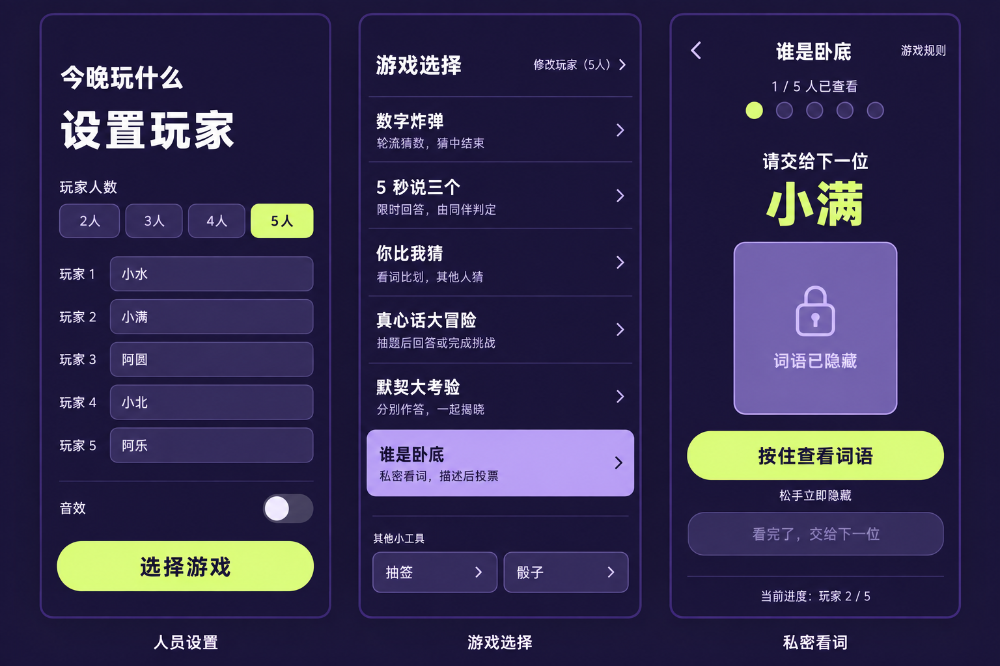

# 小水的聚会盒子

**2–5 人，打开网页就能玩的聚会小游戏。** 自己选游戏，或交给转盘决定。

作者：[Sherry 小水](https://github.com/XshuiAi) · [在线试玩](https://xshuiai.github.io/shui-party-box/) · [制作与改造 Skill](SKILL.md) · [豆包使用提示词](docs/doubao.md) · [设计与模板](docs/design.md)

## 能玩什么

| 游戏 | 人数 | 怎么玩 |
|---|---|---|
| 谁是卧底 | 4–5 人 | 每人私下看词，轮流描述，投票后揭晓 |
| 数字炸弹 | 2–5 人 | 轮流猜数字，范围逐步缩小，猜中结束 |
| 5 秒说三个 | 2–5 人 | 限时说出三个答案，由同伴判定并计分 |
| 你比我猜 | 2–5 人 | 一人只用动作表演，其他人猜，每轮 60 秒 |
| 真心话大冒险 | 2–5 人 | 切换题型、抽题、换题、轮到下一位 |
| 默契大考验 | 2–5 人 | 每人私下作答，全部完成后一起揭晓 |
| 掷骰比大小 | 2–5 人 | 每人掷一次，最高点数获胜，同点数并列 |

一台手机轮流操作，适合朋友、同学、家庭聚会。不是多人远程联机。

## 打开

直接打开 [在线试玩](https://xshuiai.github.io/shui-party-box/)；手机也可打开。下载仓库 ZIP 后双击 `index.html` 也能本地玩。保留整个目录，图片、样式和脚本都要一起带走。电脑与手机共用响应式页面。

手机适合打开部署后的 HTTPS 网页；电脑上的 `127.0.0.1` 链接不能直接拿给别人的手机使用。GitHub 仓库页面用于看代码，不等于游戏页面。

首页设置人数与姓名 → 自己选游戏／转盘抽取 → 按屏幕提示开始。谁是卧底会在不足 4 人时禁用。看词按住显示，松手隐藏。

背景音乐支持按曲目顺序循环，默认关闭；点“声音”后开启，进入游戏降低音量，切到后台暂停。具体随包音频见 [素材说明](NOTICE.md)。

## UI 与素材

默认紫色：深紫背景、浅紫立体骰子与卡牌、荧光黄按钮；选游戏采用一张大卡＋六张小卡。

| 紫色原始设计 | 紫色功能草图 |
|---|---|
|  |  |

草图是设计过程记录，含有后来删去的装饰文案，不能把它们当成最终功能清单。真实成品以开头的截图和 `index.html` 为准。

蓝色、奶油橙各保留两张设计图及两个可改造入口，详见 [全部模板](docs/design.md)。公共主页面没有换肤按钮，想改风格时让 AI 选择模板继续开发。

## 继续开发

纯 HTML、CSS、JavaScript，无后端、无构建依赖。

- `index.html`：页面结构。
- `style.css`：紫色主版和备用模板样式。
- `app.js`：题库、规则、轮流、计时、计分、投票、转盘与音乐播放。
- `music-config.js`：背景音乐列表。
- `assets/`：页面图片。
- `templates/`：蓝色、橙色的图文版与简洁版入口。
- `SKILL.md`：让 AI 基于本项目制作、修改聚会游戏。

只改题目可编辑 `FIVE`、`CHARADES`、`TRUTH`、`DARE`、`MATCH`、`SPY`。新增玩法需同时补游戏入口、初始化、回合操作与结果，检查适用人数和再玩一轮。

姓名仅存于当前浏览器，本项目不上传玩家姓名或答题记录。不含账号系统、远程房间或语音识别。

## 验证

已检查七个游戏回合、2–5 人骰子轮流与平局、转盘正向文字、按住看词、背景音频播放，以及 320–1440 像素布局。豆包工作内的导入与真实手机兼容性需按 [测试步骤](docs/doubao.md) 验证，不把 Skill 安装等同于网页托管。

## 作者与许可

Copyright © 2026 Sherry 小水。代码、题库、设计文档与随包音乐采用 [PolyForm Noncommercial 1.0.0](LICENSE)：允许个人、学习、非商业改造与分享；不得商用。分发或改编时必须保留作者、原项目链接与许可证中的 Required Notice。
