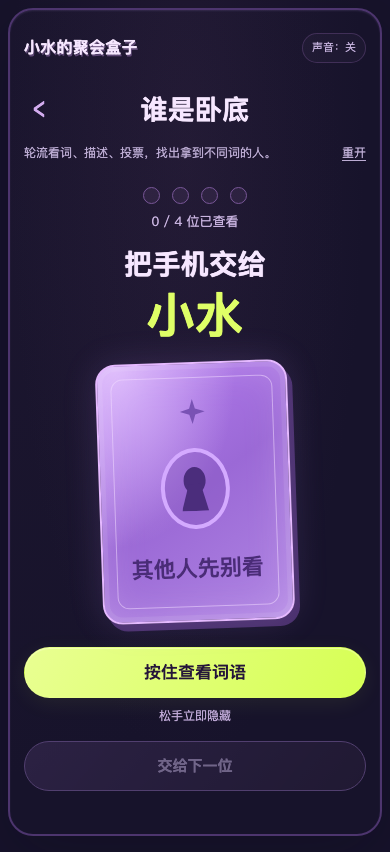
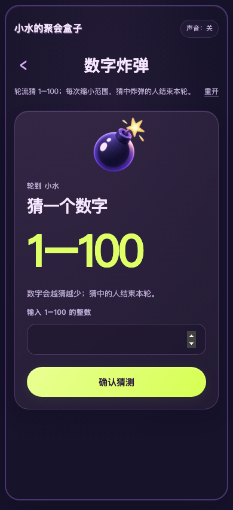
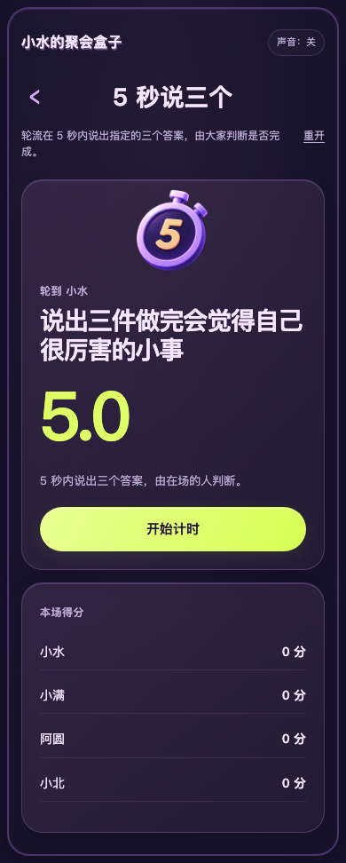
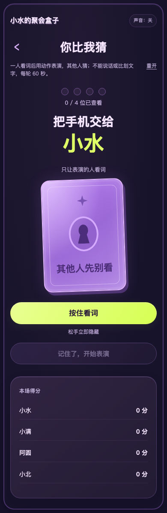
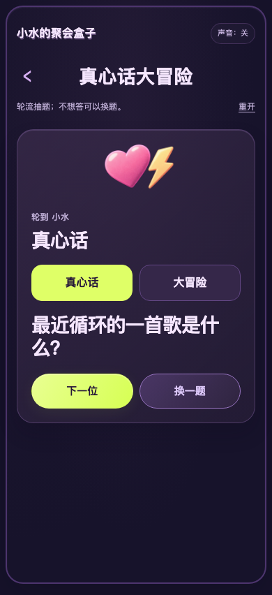
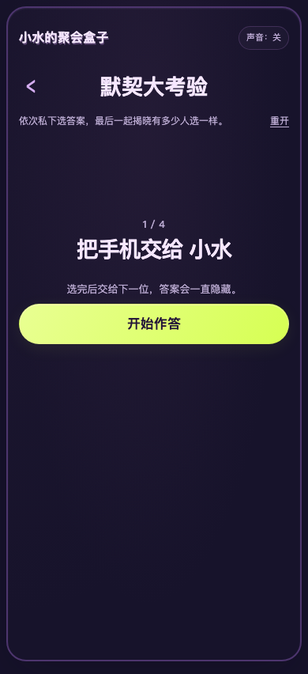
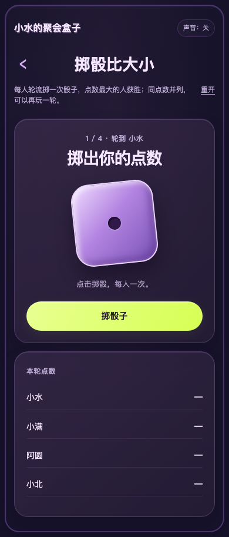
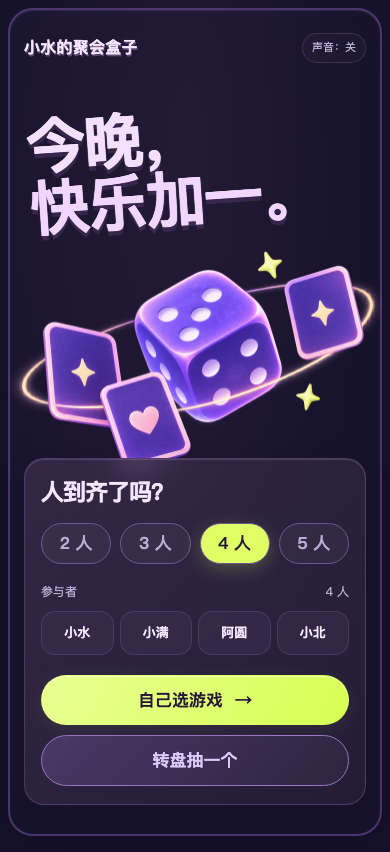
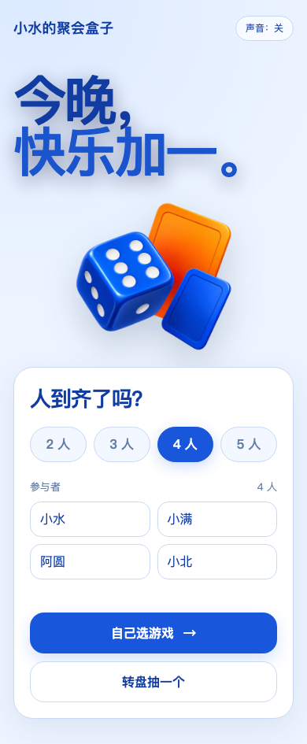
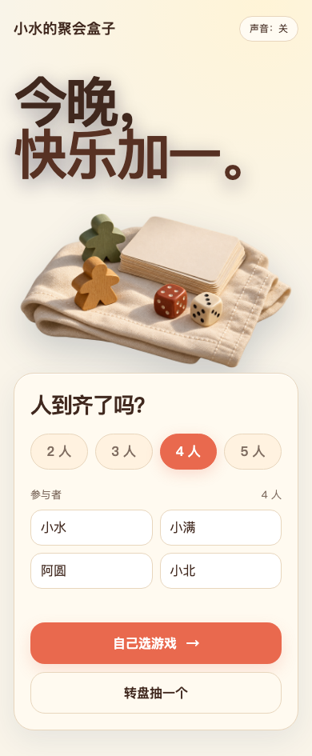

# 小水的聚会盒子

**2–5 人，一台手机轮流玩的 7 个聚会小游戏。自己选，或转盘抽一个。**

[打开就玩](https://xshuiai.github.io/shui-party-box/) · [豆包使用提示词](docs/doubao.md) · [制作与改造 Skill](SKILL.md)

作者：[Sherry 小水](https://github.com/XshuiAi)


## 怎么开始

手机打开游戏页面 → 选人数、填姓名 → 自己选或转盘抽取 → 按页面提示轮流玩。

适合朋友、同学、家庭线下聚会，一台手机传递操作，不是远程联机。音乐默认关闭，点击“声音”开启，三首依次循环。

## 有哪些游戏

### 谁是卧底｜4–5 人

每人私下按住看词，松手隐藏。轮流描述，讨论、投票，再揭晓身份。少于 4 人不可选。



### 数字炸弹｜2–5 人

轮流猜 1–100 的数字，逐步缩小可猜范围，猜中隐藏数字就结束本轮。



### 5 秒说三个｜2–5 人

看题后启动倒计时，5 秒内说出三个答案。由同伴判断是否完成，页面记录分数。



### 你比我猜｜2–5 人

一人看词后用动作表演，其他人猜。不能说话或比划文字，每轮 60 秒，猜对记录得分。



### 真心话大冒险｜2–5 人

选择题型后轮流抽题，不想回答或不想做可以换题，完成后交给下一位。



### 默契大考验｜2–5 人

针对同一道题，每人私下选择答案，全部选完后一起揭晓，看看谁和谁最有默契。



### 掷骰比大小｜2–5 人

每人轮流掷一次，全部掷完比较点数。最高点数获胜，同点数并列，可再玩一轮。



## 让豆包工作做出自己的版本

复制下面这段。示例是 4 位朋友先玩掷骰比大小，再玩谁是卧底；人数和姓名可以自己改。

```text
请获取完整项目：https://github.com/XshuiAi/shui-party-box
先阅读 README.md、SKILL.md 和 docs/doubao.md，在独立副本里使用现成代码、图片和音乐，不凭介绍重新仿写，不覆盖已有文件。

我要和 3 位朋友用一台手机轮流玩。保留默认紫色界面、全部 7 个游戏、自选和转盘、轮流、计时、计分、私密看词及三首音乐顺序循环。
先运行现成游戏，不改设计和题库。我们先玩掷骰比大小，再玩谁是卧底，姓名由我们在首页填写。

实际检查人数限制、游戏回合、返回、再玩一轮和手机窄屏排版。保留作者、原项目链接和非商用许可证。

最终我要在手机浏览器打开：
1. 如果环境支持分享网页预览，给我手机可访问的 HTTPS 地址，说明是否临时、是否会过期。
2. 如果只能生成文件或本机预览，请说明，交付完整项目文件夹或 ZIP，不只给 index.html。不要把 localhost、127.0.0.1 或 GitHub 代码页当作手机试玩链接。
3. 原版可以直接从 https://xshuiai.github.io/shui-party-box/ 打开。请区分原版和新副本，不把原版链接说成新副本的部署成果。
无法下载、安装 Skill 或运行时，说明具体卡点和需要我提供的文件，不假装成功。不要未经确认公开部署修改后的作品。
```

只想立即玩，无需安装 Skill，直接打开 [在线游戏](https://xshuiai.github.io/shui-party-box/)。

## 三种样式

想制作自己的游戏，可以直接告诉 Skill 选择紫色、蓝色或奶油橙样式，再描述玩法。默认成品使用紫色，其他两种作为继续开发的模板。

| 紫色 | 蓝色 | 奶油橙 |
|---|---|---|
|  |  |  |
| [打开](https://xshuiai.github.io/shui-party-box/) | [打开](https://xshuiai.github.io/shui-party-box/templates/blue/) | [打开](https://xshuiai.github.io/shui-party-box/templates/orange/) |

例如：“使用蓝色模板，帮我做一个四人轮流抽题的小游戏，先和我确认规则，再实现开始、操作、结果和再玩一轮。”

[模板入口与选择方法](docs/design.md)

## 下载与继续开发

纯 HTML、CSS、JavaScript，无后端、无构建依赖。下载仓库 ZIP 并解压，电脑用浏览器打开 index.html；保留整个目录，图片、脚本、样式和音乐都要带走。手机优先使用已部署的网址。

- app.js：规则、题库、轮流、计时、计分、投票与转盘。
- style.css、assets/：样式与图片。
- music-config.js：音乐列表。
- templates/：蓝色、奶油橙模板，另有简洁构图可继续开发。
- SKILL.md：AI 制作与改造说明。

姓名保存在当前浏览器，不上传姓名或答题记录。不含账号系统、远程房间或语音识别。豆包内的导入、预览与分享能力以实际环境为准。

## 作者与许可

Copyright © 2026 Sherry 小水。代码、题库、设计文档与随包音乐采用 [PolyForm Noncommercial 1.0.0](LICENSE)，不得商用。分发或改编须保留作者、原项目链接和许可证中的 Required Notice。音频说明见 [NOTICE](NOTICE.md)。
