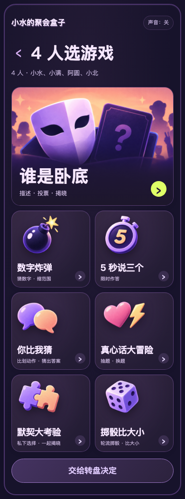

# 小水的聚会盒子

**2–5 人，一台手机轮流玩的 7 个聚会小游戏。自己选，或转盘抽一个。**

[打开就玩](https://xshuiai.github.io/shui-party-box/) · [豆包使用提示词](docs/doubao.md) · [制作与改造 Skill](SKILL.md)

作者：[Sherry 小水](https://github.com/XshuiAi)


## 怎么开始

手机打开游戏页面 → 选人数、填姓名 → 自己选或转盘抽取 → 按页面提示轮流玩。

适合朋友、同学、家庭线下聚会，一台手机传递操作，不是远程联机。音乐默认关闭，点击“声音”开启，三首依次循环。

## 有哪些游戏

<table>
<tr>
<td width="25%" valign="top"><b>谁是卧底｜4–5 人</b><br/><br/><a href="docs/screenshots/game-spy.png"></a><br/>私下看词 → 轮流描述 → 投票揭晓。</td>
<td width="25%" valign="top"><b>数字炸弹｜2–5 人</b><br/><br/><a href="docs/screenshots/game-bomb.png"></a><br/>轮流猜数字，范围逐步缩小，猜中结束。</td>
<td width="25%" valign="top"><b>5 秒说三个｜2–5 人</b><br/><br/><a href="docs/screenshots/game-five.png"></a><br/>5 秒内说出三个答案，同伴判定并计分。</td>
<td width="25%" valign="top"><b>你比我猜｜2–5 人</b><br/><br/><a href="docs/screenshots/game-charades.png"></a><br/>一人用动作表演，其他人猜，每轮 60 秒。</td>
</tr>
<tr>
<td width="25%" valign="top"><b>真心话大冒险｜2–5 人</b><br/><br/><a href="docs/screenshots/game-truth.png"></a><br/>选题型、抽题，不想答可换题。</td>
<td width="25%" valign="top"><b>默契大考验｜2–5 人</b><br/><br/><a href="docs/screenshots/game-match.png"></a><br/>每人私下作答，全部完成后一起揭晓。</td>
<td width="25%" valign="top"><b>掷骰比大小｜2–5 人</b><br/><br/><a href="docs/screenshots/game-dice.png"></a><br/>每人掷一次，最高点数获胜，同点数并列。</td>
<td width="25%" valign="top"><b>自选或转盘</b><br/><br/><a href="docs/screenshots/games.png"></a><br/>首页选人数、填姓名，自选游戏或随机抽取。</td>
</tr>
</table>

点击图片可查看大图。

## 让豆包工作做出自己的版本

复制下面这段。示例是 4 位朋友先玩掷骰比大小，再玩谁是卧底；人数和姓名可以自己改。

```text
请获取完整项目：https://github.com/XshuiAi/shui-party-box
先阅读 README.md、SKILL.md 和 docs/doubao.md，在独立副本里使用现成代码、图片和音乐，不凭介绍重新仿写，不覆盖已有文件。

我要和 3 位朋友用一台手机轮流玩。保留默认紫色界面、全部 7 个游戏、自选和转盘、轮流、计时、计分、私密看词及三首音乐顺序循环。
先运行现成游戏，不改设计和题库。我们先玩掷骰比大小，再玩谁是卧底，姓名由我们在首页填写。

实际检查人数限制、游戏回合、返回、再玩一轮和手机窄屏排版。保留作者、原项目链接和非商用许可证。

最终我要在手机浏览器打开：
1. 如果环境支持分享网页预览，给我手机可访问的 HTTPS 地址，说明是否临时、是否会过期。
2. 如果只能生成文件或本机预览，请说明，交付完整项目文件夹或 ZIP，不只给 index.html。不要把 localhost、127.0.0.1 或 GitHub 代码页当作手机试玩链接。
3. 原版可以直接从 https://xshuiai.github.io/shui-party-box/ 打开。请区分原版和新副本，不把原版链接说成新副本的部署成果。
无法下载、安装 Skill 或运行时，说明具体卡点和需要我提供的文件，不假装成功。不要未经确认公开部署修改后的作品。
```

只想立即玩，无需安装 Skill，直接打开 [在线游戏](https://xshuiai.github.io/shui-party-box/)。

## 三种模板

想制作自己的游戏，可以告诉 Skill 选择模板一、模板二或模板三，再描述玩法。每套展示两张设计参考；实际游戏内容以可玩页面为准。

### 模板一｜紫色

<table><tr>
<td width="50%"><a href="docs/design/purple-original.png"></a></td>
<td width="50%"><a href="docs/design/purple-functional.png"></a></td>
</tr></table>

[打开紫色模板](https://xshuiai.github.io/shui-party-box/)

### 模板二｜蓝色

<table><tr>
<td width="50%"><a href="docs/design/blue-original.png"></a></td>
<td width="50%"><a href="docs/design/blue-functional.png"></a></td>
</tr></table>

[打开蓝色模板](https://xshuiai.github.io/shui-party-box/templates/blue/)

### 模板三｜奶油橙

<table><tr>
<td width="50%"><a href="docs/design/orange-original.png"></a></td>
<td width="50%"><a href="docs/design/orange-functional.png"></a></td>
</tr></table>

[打开奶油橙模板](https://xshuiai.github.io/shui-party-box/templates/orange/)

例如：“使用模板二，帮我做一个四人轮流抽题的小游戏，先确认规则，再实现完整回合。”

[模板入口与选择方法](docs/design.md)

## 下载与继续开发

纯 HTML、CSS、JavaScript，无后端、无构建依赖。下载仓库 ZIP 并解压，电脑用浏览器打开 index.html；保留整个目录，图片、脚本、样式和音乐都要带走。手机优先使用已部署的网址。

- app.js：规则、题库、轮流、计时、计分、投票与转盘。
- style.css、assets/：样式与图片。
- music-config.js：音乐列表。
- templates/：蓝色、奶油橙模板，另有简洁构图可继续开发。
- SKILL.md：AI 制作与改造说明。

姓名保存在当前浏览器，不上传姓名或答题记录。不含账号系统、远程房间或语音识别。豆包内的导入、预览与分享能力以实际环境为准。

## 作者与许可

Copyright © 2026 Sherry 小水。代码、题库、设计文档与随包音乐采用 [PolyForm Noncommercial 1.0.0](LICENSE)，不得商用。分发或改编须保留作者、原项目链接和许可证中的 Required Notice。音频说明见 [NOTICE](NOTICE.md)。
