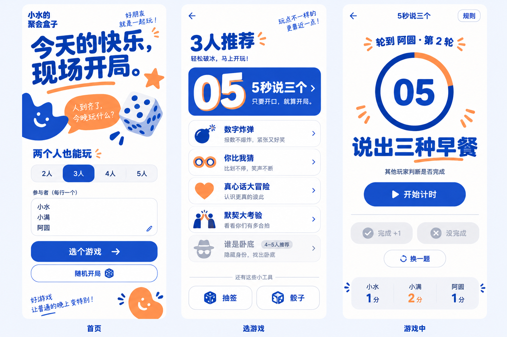
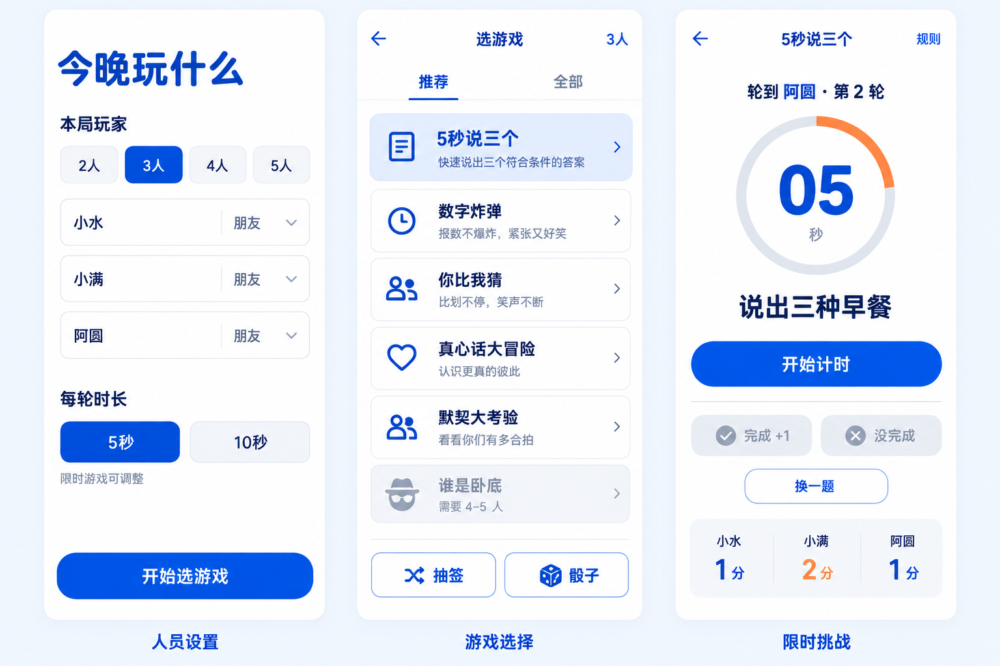
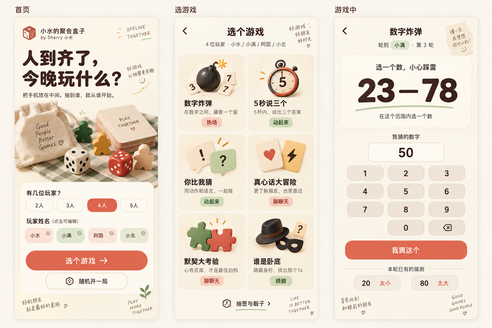
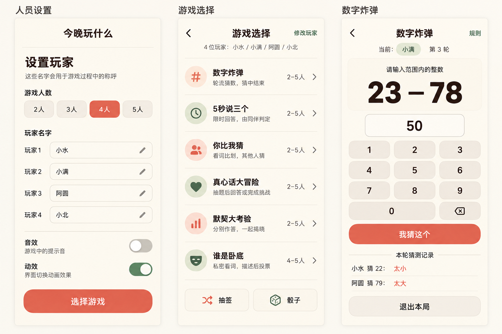

# 三种模板

想制作自己的游戏，可以告诉 Skill 选择模板一、模板二或模板三，再描述玩法。每套展示两张设计参考；实际游戏内容以可玩页面为准。

### 模板一｜紫色

<table><tr>
<td width="50%"></td>
<td width="50%"></td>
</tr></table>

[打开紫色模板](https://xshuiai.github.io/shui-party-box/)

### 模板二｜蓝色

<table><tr>
<td width="50%"></td>
<td width="50%"></td>
</tr></table>

[打开蓝色模板](https://xshuiai.github.io/shui-party-box/templates/blue/)

### 模板三｜奶油橙

<table><tr>
<td width="50%"></td>
<td width="50%"></td>
</tr></table>

[打开奶油橙模板](https://xshuiai.github.io/shui-party-box/templates/orange/)

## 对 Skill 这样说

> 使用蓝色模板制作我的聚会游戏。先问清人数、谁来操作、规则和结束条件，再给方案。保留配色与插画，不加手写标语或宣传口号。确认后在独立副本中实现，测试手机上的完整一轮和再玩一轮。

## 文件入口

- 紫色：index.html。
- 蓝色：templates/blue/index.html；另有 templates/blue/compact.html 简洁构图。
- 奶油橙：templates/orange/index.html；另有 templates/orange/compact.html 简洁构图。

三种样式共用现有游戏逻辑。开发全新玩法时，复用所选样式和必要组件，再实现自己的规则。
